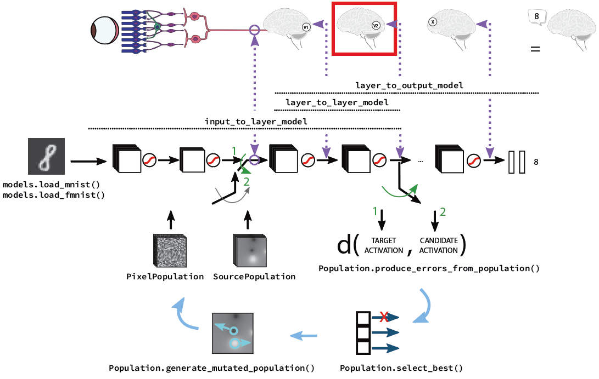

# GA-CNN OpticStim
This is the repository for the manuscript *A machine learning framework to optimize optic nerve electrical stimulation for vision restoration*, under review at [Cell: Patterns](https://www.cell.com/patterns/home). The manuscript pre-print is available [here](https://papers.ssrn.com/sol3/papers.cfm?abstract_id=3787903).

**Authors:** Simone Romeni, Davide Zoccolan, Silvestro Micera.

## A short guide to the repository

### Main scripts
This repo contains the scripts:
* `static_landscape.py`, which performs static landscape optimization;
* `smooth_evolution.py`, which performs dynamic landscape gradual variation optimization;
* `dynamic_landscape_arch.py`, `dynamic_landscape_noarch.py`, which perform dynamic landscape abrupt variation optimization, with and without archives;
* `fill_archive.py`, which fills the archive for the dynamic landscape abrupt variation optimization;
* `psychophysics_data.py`, which contains the healthy subject classifications of source-wise reconstructed stimuli.

### CNN models and submodels
In all optimization scripts, three different submodels are obtained from the full CNN network whose trained weights are loaded with the `models.load_model(model_name)` function call. The submodels are obtained as
* `input_to_layer_model = create_input_to_layer_model(model=model, layer_list=layer_list)` used to obtain the activation maps at the desired layers from input stimuli, using the model `model`. It simulates the natural (healthy) stream of activation between the image space and the activation in a given region (here, most often a cortical one);
* `layer_to_layer_model = create_layer_to_layer_model(model=model, layer1=layer1, layer2=layer2)` used to obtain the activation map at a given layer (`layer2`) given the activation map at a upstream layer (`layer1`) from the model `model`. Here, it simulates the patient's optic-nerve-to-cortical-region map;
* `layer_to_output_model = create_layer_to_output_model(model=model, layer=layer)` used to obtain the classification of a given activation pattern applied at the layer `layer` in model `model`. Here, it is used to obtain the classification of the perceived sensation following a stimulation.

#### Candidate stimulation populations
Two different `Population` subclasses are defined in `populations.py`:
* `SourcePopulation` used for candidate imperfect-selectivity stimulations;
* `PixelPopulation` used for candidate perfect-selectivity stimulations.

On each population subclass we have defined methods to generate a random population (`generate_random_population`), to generate a mutated population from a parent population (`generate_mutated_population`), to produce errors and activations from the population (`produce_errors_from_population`, and `produce_activations_from_population`). These methods, with the `join_populations` method, are used in the main scripts to implement our simple evolutionary heuristic. Notice that to produce errors and activations, adequate layer-to-layer model and target activations should be given.

## Utilities
The files `models.py`, `populations.py`, and `utils.py` contain classes and methods that are used in the main scripts.

### Methods in `models.py`:
* `(x_train, y_train), (x_test, y_test) = load_fmnist()`
* `(x_train, y_train), (x_test, y_test) = load_mnist()`
* `model = create_LindseyNet(input_shape, N_BN, D_VVS, scale)`
* `save_model(model, model_name)`
* `model = load_model(model_name)`
* `input_to_layer_model = create_input_to_layer_model(model, layer_list)`
* `layer_to_layer_model = create_layer_to_layer_model(model, layer1, layer2)`
* `layer_to_output_model = create_layer_to_output_model(model, layer)`

### Methods in `populations.py`
* `new_pop = join_populations(populations)` merge population in a list into a new population;
* `pop = generate_population_for_mutation(population, distribution, count)` generate a population for mutation from a parent population (used when each parent can have more than one child).

#### Class `Population`
**Properties**
* `n_individuals` number of individuals in the population;
* `img_dim` size of the activation fiters;
* `data` individuals in the population (associated stimulation patterns);
* `errors` errors produced by the individuals with respect to a given target (used to select best individuals);
* `activations` activations produced by the individuals with respect to a given model (used when individuals are archived -- obtain individuals producing the activation pattern most similar to a target one);
* `identity` unique identifier of the individual along evolution (not used in this work);
* `parent_identity` identifier of the single parent of the individual (works because here we have only single parent mutation, not used in this work);
* `categories` output class produced by the individual stimulation from a given model (not explicitly used in this work).

**Methods**
* `select_best_individuals(self, n_best)`
* `reorder_population(self)`
* `copy_template(self)`
* `extract_individuals(self, idx)`
* `substitute_individuals(self, pop2, idx1, idx2)`

##### Subclass `SourcePopulation`
**Additional properties**
* `n_sources` number of stimulation sources allowed.

**Additional methods**
* `generate_random_population(self, init_identity=False, last_id=0)`
* `copy_template(self)`
* `generate_mutated_population(self, probabilities)`
* `convert_to_pixels(self, n_filters)`
* `produce_errors_from_population(self, layer_to_layer_model, target, sel=None, store=True)`
* `produce_activations_from_population(self, layer_to_layer_model, store=False)`

##### Subclass `PixelPopulation`
**Additional properties**
* `n_filters` number of filters in the stimulation layer.

**Additional methods**
* `generate_random_population(self, init_identity=False, last_id=0)`
* `copy_template(self)`
* `generate_mutated_population(sef, probabilities)`
* `produce_errors_from_population(self, layer_to_layer_model, target, sel=None, store=True)`
* `produce_activations_from_population(self, layer_to_layer_model, store=False)`

### Methods in `utils.py`

### Dependencies
We employed Python 3.7.6 and the following versions for the employed modules:
* <code>keras\==2.3.1</code>
* <code>numpy\==1.19.5</code>
* <code>scipy\==1.4.1</code>
* <code>skimage\==0.17.2</code>
* <code>sklearn\==0.23.2</code>
* <code>tensorflow\==2.1.0</code>

All data needed to execute the scripts are contained in the folder.
